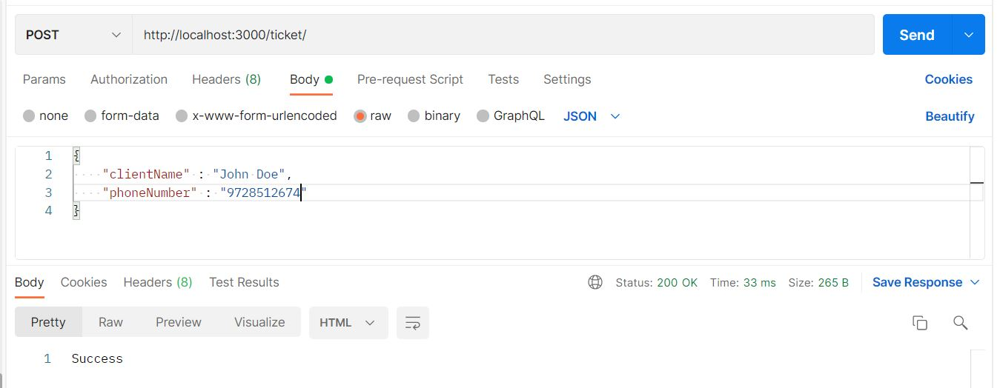
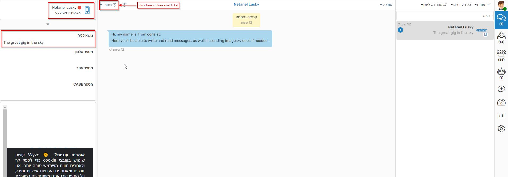

# Consist Entry Level Exam

## Getting Started
1. Make sure you have a [GitHub](https://github.com) account
2. Go [here](https://github.com/new/import) and import this repository into your account. Make sure to select the **private** option
3. [Clone](https://github.com/wix-incubator/mobile-students-exam) your new repository to your computer
4. Make sure you have *Node.js* 10 or higher and *npm* 6 or higher installed
5. Install the project dependencies by running `npm install` from the project's directory (using a terminal)
6. Run the project by running `npm start`

You should now have the development version running on your computer and accessible via http://localhost:3000

## Glassix Documentation
Explore our Developer [references](https://docs.glassix.com/reference/overview) and try out our API for yourself with a few easy steps.
If you need help getting started or get stuck, check out our comprehensive guides.
Let's jump right in!
https://docs.glassix.com/reference/overview

## Before you start
The current code base is far from perfect. While you complete the following tasks, try to improve the existing code.
We added a code to get Access Token , An Access Token is a short-lived credential used to authenticate your application to Glassix, use this code.

### Part A - Create a post request in postman:
Before you begin glassix tasks, we have created an endpoint that listens for post requests in port 3000
Inside the body there are 2 parameters: clientName, phoneNumber \
**Note:** the phone number must be your phone number and with and starting with 972 \
These parameters will serve us in ticket details in the next task \

### Part B - Create a Ticket Using the API:
[Create a Ticket Guid](https://docs.glassix.com/docs/create-a-ticket-using-the-api) \
**Note:** You can open only one ticket per phone number, If you want to reopen it you will need to close the open ticket and try again, \
After the Post Request arrives
Create ticket With the following params
* field1 - The great gig in the sky
* culture - en-US
* participants.type - Client 
* participants.name - clientName parameter
* participants.protocolType - WebViaSMS
* participants.identifier - phoneNumber parameter

### Part C - Send a message using the API:
[Send a message](https://docs.glassix.com/reference/send-ticket) \
After you create a Ticket, you must send a message to the Ticket you created \
Send the following text to the ticket you created
'Hi, Its a nice task'

### Part D - Close the ticket you opened:
[Set State](https://docs.glassix.com/reference/set-ticket-state) \
Use the following documentation to close the ticket you opened \

### Part E - Bonus mission
In the code we developed we created a function that creates a token, but the token is valid for 3 hours,
there is no need to generate the token in every action
Improve the code to get a token every 3 hours and not every action

## General notes

* Test your work well. Think of edge cases. Think of how users will use it, and make sure your work is of high quality
* Stick to the best practices of the libraries used as much as possible
* If you have any questions regarding the task itself or its environment, feel free to ask in the mail netanell@consist.co.il. For general coding / technology questions, please consult stack overflow, forums and other sources of your choice

## Submitting

1. add username: `CoinsistDev`, email: `consist.development@gmail.com` as collaborators to your imported repo.
2. send the repo's URL back to the email you got from us.

## 
